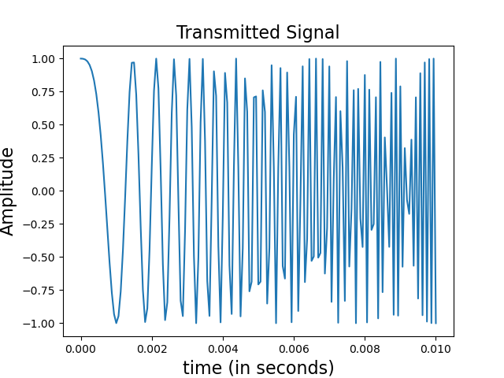

# The AUV Project
Autonomous Underwater Vehicle Simulation

**Note**: 
- The aim is to create a project that is a combination of my signal processing, perception and control and deep learning skills. Its lowkey low priority, so its gonna be a while. 
- The primary implementation will be in C++, with LibTorch (PyTorch's C++). 
- The end-product is an surveillance AUV whose primarily primary role is to keep mapping the same area despite presence of obstructive features and terrain without premapping. 

## Overview
The project involves the following major pipelines

- Terrain and Assets (transmitter, ULA) creation. 
- Signal Simulation pipeline
- Imaging pipeline (Front-Looking and Side-Scan)
- Control pipeline (DQN)

<!-- ### Floor Setup
<!-- 
 -->

<!-- 

  

    
    
Figure 2D

  

  

    
    
Figure 3D

  

### Signal Setup

 --> 
