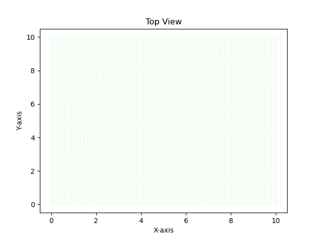
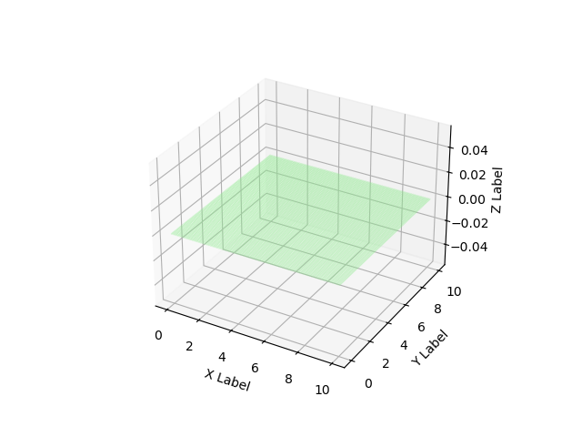

# AUV
Autonomous Underwater Vehicle Simulation

**Note**: The aim is to create a project that is a combination of my signal processing, perception and control and deep learning skills. Its lowkey low priority, so its gonna be a while. 

## Overview
The aim is to build an autonomous underwater vehicle simulation and system pipeline that would conduct a number of tasks. 

- Floor simulation
- Floor mapping
- anomaly detection
- perception and control

### Floor Setup

